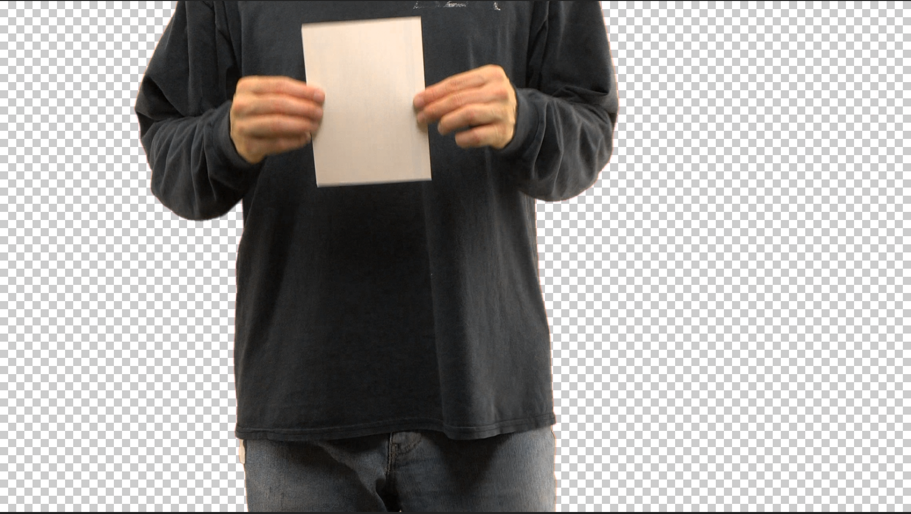

KeyStatus
=======
After Effects plugin to visualize alpha status when keying
-----------

An After Effects plugin which renders the alpha channel to opaque RGB in an exaggerated way that emphasizes partially transparent pixels. This is useful to check your output when keying, it will help you spot problems such as partially transparent areas on your subject, or partially opaque spots on your background, which might cause problems later. It is similar to the "Status" in KeyLight, except that it can be applied anywhere for cases when your keying is multiple steps beyond a simple KeyLight instance. Recommended to put this in an Adjustment Layer, marked as a Guide layer, so that you can easily enable it at any time after adjusting your key.

Untested on Windows.

# Build and install

Download AfterEffectsSDK
Put this project's code into AfterEffectsSDK/Examples/Effect/Keystatus
sudo mkdir /Library/Application\ Support/Adobe/Common/Plug-ins/7.0/MediaCore/KeyStatus
chown the above dir to yourself, or use chgrp chmod or something else to make it writeable by your user account, so that XCode can copy the compiled effect there without permission problems
open XCode project
command-B

